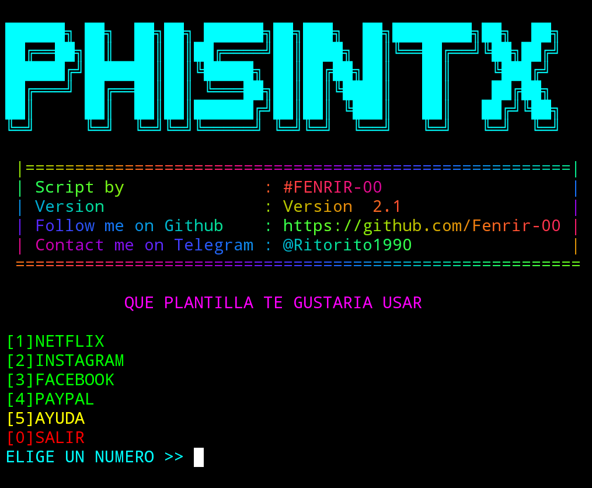
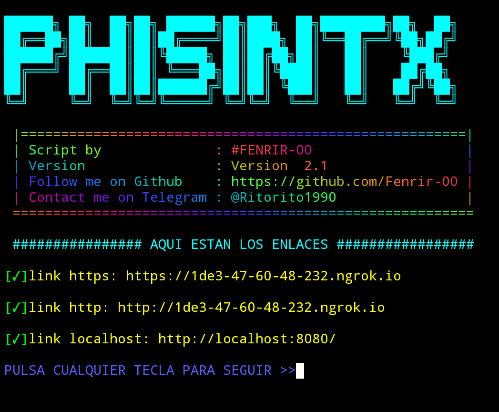
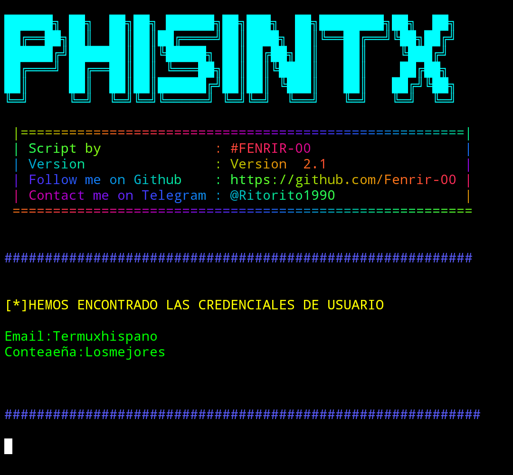

# instalación
``` bash
pkg install git
```
```bash
pkg install python
```
```bash
git clone https://github.com/Fenrir-00/phising
```
```bash
cd phising 
```
```bash
python3 phisingtx.py
```


# SOLO PARA FINES EDUCATIVOS
# NO ME HAGO RESPONSABLE DEL MAL USO
